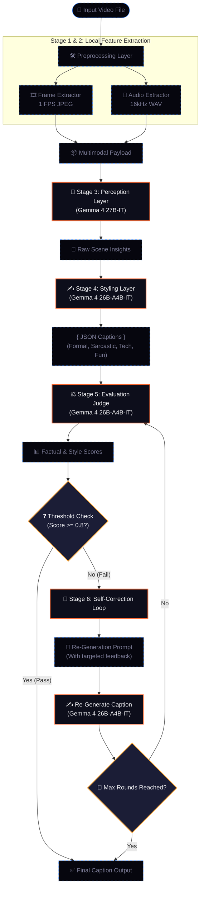

# 🎬 Rambler — Architecture Diagram

This document provides a visual representation of the Rambler pipeline and deployment architectures.

---

## 1. Pipeline Execution Flow

The flowchart below visualizes the 6-stage multi-model Gemma cascade, showing data transformations and the self-correction feedback loop.



---

## 2. Dynamic Sequence Diagram

The sequence diagram below shows how client interactions, the orchestration layer, and the backends (Fireworks AI vs. local vLLM) interact.

```mermaid
sequenceDiagram
    autonumber
    actor User as User / Judge
    participant App as Streamlit Application (app.py)
    participant Pipe as Pipeline Orchestrator (pipeline.py)
    participant Backend as Inference Backend (vLLM / Fireworks)

    User->>App: Upload Video & Set Parameters (Threshold >= 0.8)
    App->>Pipe: Trigger run_pipeline()
    activate Pipe
    
    Pipe->>Pipe: Extract Frames (OpenCV) & Audio (FFmpeg)
    Pipe->>Backend: Request Multimodal Perception (Gemma-4-31b-it)
    Backend-->>Pipe: Return Raw Scene Insights
    
    Pipe->>Backend: Request Style Synthesis (Gemma-4-26b-a4b-it)
    Backend-->>Pipe: Return JSON Styled Captions (4 Styles)
    
    rect rgb(20, 20, 40)
        note right of Pipe: Evaluation & Self-Correction Loop
        Pipe->>Backend: Request Evaluation Scoring
        Backend-->>Pipe: Return Accuracy & Style Scores
        
        alt Any Score < 0.8 and Round < Max Rounds
            Pipe->>Backend: Request Re-generation with Feedback
            Backend-->>Pipe: Return Corrected Caption
        end
    end
    
    Pipe-->>App: Return Final Results (Captions, Scores, History)
    deactivate Pipe
    
    App->>User: Render Dashboard (Video, Overlay/Cards, Plotly Radar Chart)
```



---

## 3. Hybrid Deployment Setup

Rambler dynamically routes inference requests based on the configured environment.

```
                  ┌───────────────────────────────┐
                  │        Rambler App            │
                  └──────────────┬────────────────┘
                                 │
                   Reads INFERENCE_BACKEND env
                                 │
                 ┌───────────────┴───────────────┐
                 │                               │
       INFERENCE_BACKEND=local       INFERENCE_BACKEND=fireworks
                 │                               │
        ┌────────▼────────┐             ┌────────▼────────┐
        │   Local Port    │             │  Fireworks AI   │
        │   (vLLM/ROCm)   │             │   Cloud API     │
        └────────┬────────┘             └────────┬────────┘
                 │                               │
        ┌────────▼────────┐             ┌────────▼────────┐
        │  AMD Instinct   │             │  Dedicated GPU  │
        │   MI300X GPU    │             │   (H200/B200)   │
        └─────────────────┘             └─────────────────┘
```
